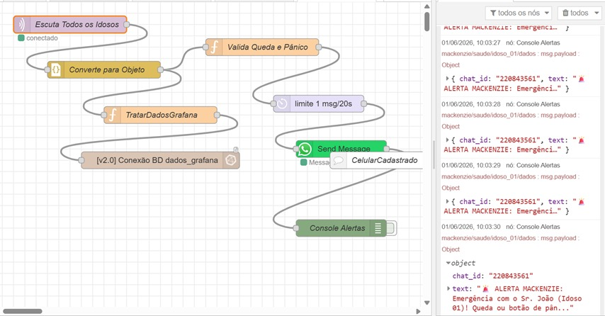
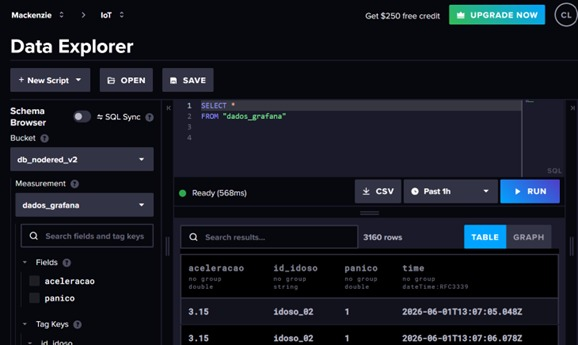
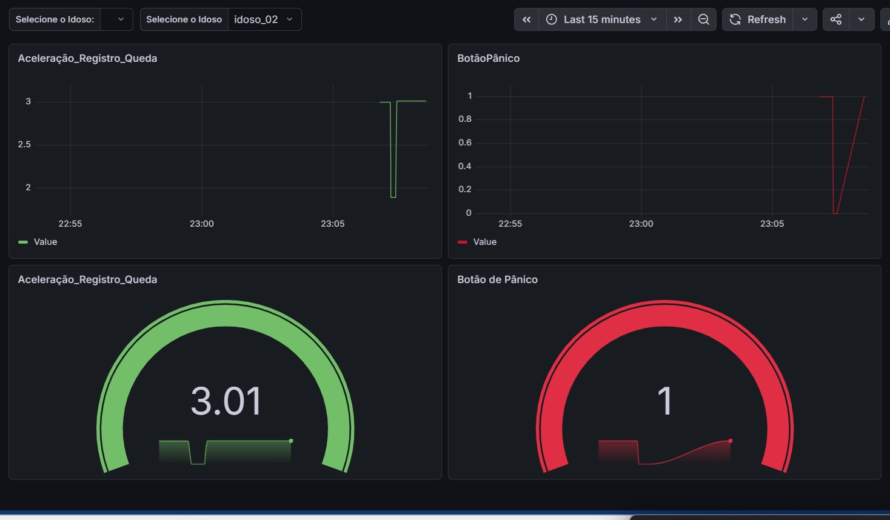

raw
Readme · MD
# 🏥 Sistema IoT de Monitoramento e Alerta Automatizado para Quedas em Idosos
 
> Projeto acadêmico desenvolvido na **Universidade Presbiteriana Mackenzie** — Faculdade de Computação e Informática (2026)
 
[](https://wokwi.com)
[](https://hivemq.com)
[](https://nodered.org)
[](https://influxdata.com)
[](https://grafana.com)
[](https://brasil.un.org/pt-br/sdgs/3)
[](https://aws.amazon.com/ec2)
 
---
 
## 🎬 Links do Projeto
 
| Recurso | Link |
|---|---|
| 📹 Vídeo de demonstração (YouTube) | [https://www.youtube.com/watch?v=vbAUZe5c70E](https://www.youtube.com/watch?v=vbAUZe5c70E) |
 
---
 
## 📋 Sumário
 
- [Sobre o Projeto](#sobre-o-projeto)
- [Arquitetura do Sistema](#arquitetura-do-sistema)
- [Componentes Utilizados](#componentes-utilizados)
- [Topologia Lógica](#topologia-lógica)
- [Estrutura do Repositório](#estrutura-do-repositório)
- [Como Funciona](#como-funciona)
- [Infraestrutura AWS](#infraestrutura-aws)
- [Configuração e Execução](#configuração-e-execução)
- [Resultados](#resultados)
- [Autores](#autores)
- [Referências](#referências)
---
 
## 📌 Sobre o Projeto
 
Sistema de **Internet das Coisas (IoT)** voltado ao monitoramento contínuo de idosos e à detecção automatizada de quedas. Ao identificar aceleração superior a **3g** ou o acionamento manual do **botão de pânico**, o sistema dispara alertas automatizados via **WhatsApp (API CallMeBot)**, notificando familiares e cuidadores em tempo real.
 
O projeto alinha-se ao **Objetivo de Desenvolvimento Sustentável 3 (ODS 3)** da Agenda 2030 da ONU — especificamente à meta 3.4, que visa reduzir em um terço a mortalidade prematura decorrente de acidentes até 2030.


 
**Por que acelerômetro e não câmera?**  
Soluções baseadas em visão computacional exigem câmeras, processamento de vídeo e levantam questões de privacidade que limitam sua adoção em residências. O acelerômetro MPU6050 detecta quedas a partir de dados de inércia bruta, sem comprometer a intimidade do monitorado, com custo muito inferior.
 
 
---
 
## 🏗️ Arquitetura do Sistema
 
O sistema adota uma **arquitetura IoT descentralizada em camadas**:
 
```
┌─────────────────────────────────────────────────────────────────┐
│                     CAMADA DE PERCEPÇÃO                         │
│   [ESP32 + MPU6050 + Botão Pânico + Buzzer]  (×2, via Wokwi)   │
└───────────────────────────┬─────────────────────────────────────┘
                            │ MQTT (tópico: mackenzie/saude/+/dados)
┌───────────────────────────▼─────────────────────────────────────┐
│                    CAMADA DE COMUNICAÇÃO                        │
│                  HiveMQ Broker MQTT (cloud)                     │
└───────────────────────────┬─────────────────────────────────────┘
                            │
┌───────────────────────────▼─────────────────────────────────────┐
│                   CAMADA DE PROCESSAMENTO                       │
│        Node-RED (orquestração + regras de negócio)              │
│     ┌──────────────────┐     ┌──────────────────────────┐       │
│     │  Valida queda /  │     │   TratarDadosGrafana     │       │
│     │  pânico (>3g)    │     │   (formata p/ InfluxDB)  │       │
│     └────────┬─────────┘     └────────────┬─────────────┘       │
└──────────────┼──────────────────────────── ┼────────────────────┘
               │                             │
   ┌───────────▼───────────┐    ┌────────────▼────────────┐
   │  CAMADA DE ALERTA     │    │  CAMADA DE PERSISTÊNCIA  │
   │  WhatsApp CallMeBot   │    │    InfluxDB Cloud        │
   │  (< 3s após evento)   │    │  (bucket: db_nodered_v2) │
   └───────────────────────┘    └────────────┬────────────┘
                                             │
                                ┌────────────▼────────────┐
                                │  CAMADA DE VISUALIZAÇÃO  │
                                │    Grafana Dashboard     │
                                │  (filtro dinâmico/idoso) │
                                └─────────────────────────┘
```
 
### Exemplo


### Nossa estrutura


 
 
---
 
## 🔧 Componentes Utilizados
 
| Componente | Tipo | Função no Sistema |
|---|---|---|
| ESP32 (×2) | Microcontrolador virtual | Processamento e comunicação Wi-Fi/MQTT |
| MPU6050 (×2) | Acelerômetro 3 eixos (virtual) | Detecção de aceleração e queda (>3g) |
| Buzzer (×2) | Atuador sonoro (virtual) | Alarme local ao detectar queda ou pânico |
| Botão de pânico (×2) | Entrada digital (virtual) | Acionamento manual de alerta pelo idoso |
| HiveMQ Cloud | Broker MQTT | Roteamento de mensagens MQTT |
| Node-RED | Plataforma low-code | Orquestração, regras de negócio e alertas |
| InfluxDB Cloud | Banco de dados | Armazenamento de série temporal |
| Grafana Cloud | Dashboard | Visualização em tempo real |
| CallMeBot API | API WhatsApp | Envio de notificações de emergência |
| Wokwi | Simulador web | Simulação dos dispositivos ESP32 |
| AWS EC2 (nodered) | Servidor cloud (t2.medium) | Hospedagem do Node-RED em produção |
 
---
 
## 📡 Topologia Lógica
 
Endereços FQDN e IPs de todos os elementos da arquitetura:
 
| Elemento | FQDN | Endereço / Porta |
|---|---|---|
| Wokwi (Dispositivos) | `wokwi.com` | HTTPS / Simulador web |
| Broker MQTT (HiveMQ) | `broker.hivemq.com` | IP: 3.70.46.54 / Porta: 1883 |
| Node-RED (AWS EC2) | `174.129.147.230` | HTTP / Porta: 1880 |
| InfluxDB Cloud | `us-east-1-1.aws.cloud2.influxdata.com` | HTTPS / Porta: 443 |
| Grafana Cloud | `cleidelustosa.grafana.net` | HTTPS / Porta: 443 |
| CallMeBot API | `api.callmebot.com` | HTTPS / Porta: 443 |
 
---
 
## 📁 Estrutura do Repositório
 
```
Sistema-IoT-de-Monitoramento/
│
├── Grafana/
│   └── aceleracao_setor.md      # Query Flux para o painel de aceleração/pânico no Grafana
│
├── Influx-DB/
│   └── bancodedados.sql         # Query SQL para consulta dos dados no InfluxDB
│
├── Node-Red/
│   └── fluxo.json               # Fluxo completo para importar no Node-RED
│
├── Worki/                       # Simulações no Wokwi
│   ├── diagram_1.json           # Diagrama de hardware do Idoso 01
│   ├── diagram_2.json           # Diagrama de hardware do Idoso 02
│   ├── instancia_1.json         # Firmware do ESP32 — Idoso 01 (arquivo .ino em .json)
│   └── instancia_2.json         # Firmware do ESP32 — Idoso 02 (arquivo .ino em .json)
│
└── README.md
```
 
> ⚠️ Os arquivos `instancia_1.json` e `instancia_2.json` contêm código Arduino (`.ino`) salvo com extensão `.json` pelo Wokwi. Para usar no Arduino IDE, renomeie para `.ino`.
 
---
 
## ⚙️ Como Funciona
 
### 1. Firmware ESP32 (ciclo de 1 segundo)
 
Cada dispositivo executa continuamente:
 
1. **Leitura do MPU6050** nos três eixos (X, Y, Z) via I2C
2. **Cálculo da aceleração total**: `√(ax² + ay² + az²) / 9,81`
3. **Verificação do botão de pânico** com lógica de toggle e debounce de 50ms
4. **Publicação do payload JSON** via MQTT:
   ```json
   {"id":"idoso_01","aceleracao":3.24,"panico":false}
   ```
5. **Acionamento do buzzer** em modo intermitente (300ms) quando `aceleração > 3g` ou `pânico == true`


 
### 2. Tópicos MQTT
 
| Idoso | Tópico de Publicação |
|---|---|
| Idoso 01 | `mackenzie/saude/idoso_01/dados` |
| Idoso 02 | `mackenzie/saude/idoso_02/dados` |
| Node-RED (escuta) | `mackenzie/saude/+/dados` (wildcard) |
 
### 3. Fluxo Node-RED
 
```
MQTT In → JSON Parser → ┬→ TratarDadosGrafana → InfluxDB Out
                        └→ Valida Queda/Pânico → Rate Limiter (1 msg/20s) → WhatsApp
```
 


 
### 4. Regra de detecção
 
```javascript
if (panico === true || aceleracao > 3.0) {
    // Dispara alerta WhatsApp personalizado por idoso
}
```
 
### 5. Banco de dados (InfluxDB)
 
- **Bucket**: `db_nodered_v2`
- **Measurement**: `dados_grafana`
- **Fields**: `aceleracao` (double), `panico` (0 ou 1)
- **Tag**: `id_idoso` ("idoso_01" ou "idoso_02")


 
---

### 6. Dashboard (Grafana)
 
- **URL**: `https://cleidelustosa.grafana.net`
- Dois painéis de série temporal: **Aceleração** e **Botão de Pânico**
- Dois gauges em tempo real exibindo os valores mais recentes
- Filtro dinâmico por idoso via dropdown (`idoso_01` / `idoso_02`)
- Janela de visualização configurável (padrão: últimos 15 minutos)


 
---
 
## ☁️ Infraestrutura AWS
 
O Node-RED, responsável por toda a orquestração do sistema, é executado em uma instância **EC2 na AWS (Amazon Web Services)**.
 
### Instância de produção — `nodered`
 
| Atributo | Valor |
|---|---|
| **ID da instância** | `i-002d7fa3d7c0c1b4f` |
| **Tipo** | `t2.medium` (2 vCPUs, 4 GB RAM) |
| **Sistema operacional** | Ubuntu 24.04 LTS (Noble Numbat) |
| **Região / Zona** | us-east-1b — US East (N. Virginia) |
| **IP público** | `174.129.147.230` |
| **IP privado** | `172.31.20.45` |
| **DNS público** | `ec2-54-152-107-214.compute-1.amazonaws.com` |
| **Par de chaves** | `cleide_lustosa` |
| **Virtualização** | HVM |
 
> ⚠️ O IP público de uma instância EC2 padrão muda a cada reinicialização. Para um ambiente estável, considere associar um **Elastic IP** à instância.
 
### Por que EC2 para o Node-RED?
 
O Node-RED precisa estar acessível 24h/dia para receber mensagens MQTT e disparar alertas em tempo real. Rodar localmente (notebook/desktop) tornaria o sistema dependente de uma máquina ligada. A instância EC2 resolve isso com disponibilidade contínua na nuvem.
 
### Acesso à instância via SSH
 
```bash
ssh -i "cleide_lustosa.pem" ubuntu@174.129.147.230
```
 
### Acesso ao painel Node-RED
 
Após iniciar o serviço na EC2, o Node-RED fica disponível em:
 
```
http://174.129.147.230:1880
```
 
> 🔒 Certifique-se de que o **Security Group** da instância permite tráfego de entrada na porta `1880`. Recomenda-se restringir o acesso por IP para evitar exposição pública desnecessária.
 
---
 
## 🚀 Configuração e Execução
 
### Pré-requisitos
 
- Conta no [Wokwi](https://wokwi.com)
- Instância do [Node-RED](https://nodered.org) (local ou cloud)
- Conta no [InfluxDB Cloud](https://cloud2.influxdata.com)
- Conta no [Grafana Cloud](https://grafana.com)
- Chave de API do [CallMeBot](https://www.callmebot.com/blog/free-api-whatsapp-messages/)
### Passo a passo
 
#### 1. Simulação no Wokwi
 
1. Acesse [wokwi.com](https://wokwi.com) e crie dois projetos ESP32
2. Em cada projeto, importe o `diagram_X.json` correspondente (Hardware → Upload)
3. Copie o conteúdo de `instancia_X.json` para o arquivo `sketch.ino` do projeto
4. Execute as duas simulações simultaneamente
#### 2. Node-RED (via AWS EC2)
 
O Node-RED roda na instância EC2 `nodered`. Para configurar do zero:
 
1. Acesse a instância via SSH:
   ```bash
   ssh -i "cleide_lustosa.pem" ubuntu@174.129.147.230
   ```
2. Instale o Node-RED (caso ainda não esteja instalado):
   ```bash
   bash <(curl -sL https://raw.githubusercontent.com/node-red/linux-installers/master/deb/update-nodejs-and-nodered)
   sudo systemctl enable nodered
   sudo systemctl start nodered
   ```
3. Instale os pacotes necessários:
   ```bash
   cd ~/.node-red
   npm install node-red-contrib-influxdb
   npm install node-red-contrib-whatsapp-cmb
   ```
4. Acesse o painel pelo navegador: `http://174.129.147.230:1880`
5. No menu, vá em **Import** e cole o conteúdo de `Node-Red/fluxo.json`
6. Configure o nó **InfluxDB**: insira a URL, organização, bucket e token da sua conta InfluxDB Cloud
7. Configure o nó **WhatsApp CallMeBot**: insira seu número e chave de API
8. Faça o **Deploy**
#### 3. InfluxDB Cloud
 
1. Crie um bucket chamado `db_nodered_v2`
2. Crie um token de acesso com permissão de escrita
3. Use a query de `Influx-DB/bancodedados.sql` para consultar os dados no Data Explorer
#### 4. Grafana
 
1. Adicione o InfluxDB Cloud como data source (linguagem: **Flux**)
2. Configure: URL, organização, token e bucket
3. Crie um dashboard e use a query de `Grafana/aceleracao_setor.md`
4. Adicione uma variável de template `idoso` vinculada ao campo `id_idoso` para o filtro dinâmico
---
 
## 📊 Resultados
 
| Dimensão | Resultado | Observação |
|---|---|---|
| Detecção de queda (>3g) | ✅ Validado | Dois dispositivos simultâneos |
| Botão de pânico (toggle) | ✅ Validado | Debounce de 50ms funcional |
| Latência MQTT | < 200ms | Broker HiveMQ público |
| Alerta WhatsApp | < 3 segundos | API CallMeBot |
| Persistência InfluxDB | ✅ Validado | Bucket db_nodered_v2 |
| Dashboard Grafana | ✅ Funcional | Filtro dinâmico por idoso |
| Escalabilidade | Arquitetura | Novos idosos via novo tópico MQTT |
 
---
 
## 👥 Autores
 
Desenvolvido por estudantes da Universidade Presbiteriana Mackenzie — Faculdade de Computação e Informática (2026):
 
- Cleide Lustosa de Oliveira da Silva
- Estephany Nicole da Silva
- Ana Julia Blande Silva
- Nicolas Guilherme da Silva
- Wallace Santana
---
 
## 📚 Referências
 
- WHO. *Falls*. Geneva: WHO, 2021. Disponível em: https://www.who.int/news-room/fact-sheets/detail/falls
- NAÇÕES UNIDAS BRASIL. *Objetivo 3: Saúde e Bem-Estar*. Disponível em: https://brasil.un.org/pt-br/sdgs/3
- KWOLEK, B.; KEPSKI, M. Human fall detection using depth maps and accelerometers. *Computer Methods and Programs in Biomedicine*, v. 121, n. 3, p. 489-496, 2014.
- SANTHANAMARI, G. et al. A Smart Wearable-Based Fall Detection and Health Monitoring System for Elderly. IEEE ICNGCS, 2025.
- SINGH, A. et al. YOLO Based Smart Fall Detection. IEEE Global AI Summit, 2024.
- TÎRZIU, E.; DOBRE, C. AI-Powered Assistive Technologies for Fall Detection. IEEE CSCS, 2025.
---
 
<div align="center">
  <sub>Projeto alinhado ao ODS 3 da Agenda 2030 da ONU — Saúde e Bem-Estar para Todos</sub>
</div>
